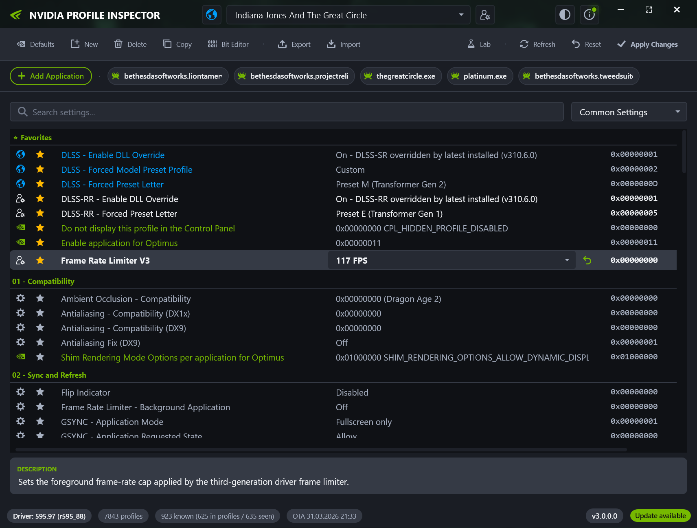

 **NVIDIA Profile Inspector**

This tool is used for modifying game profiles inside the internal driver database of the nvidia driver.
All game profiles are provided by the nvidia driver, but you can add your own profiles for games missing in the driver database.
You also have access to hidden and undocumented settings, which are not provided by the drivers control panel.

For more information how to use this tool, you can find some very good wikis here:
* https://wiki.step-project.com/Guide:NVIDIA_Inspector
* https://www.pcgamingwiki.com/wiki/Nvidia_Profile_Inspector

