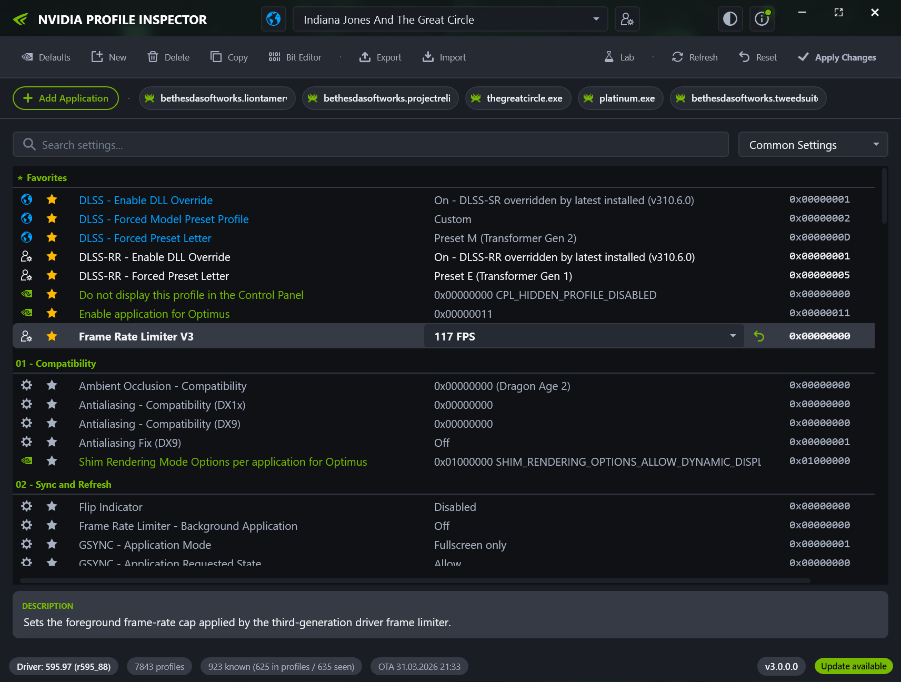

# NVIDIA Profile Inspector

[](LICENSE)
[](#requirements)
[](#build-from-source)

NVIDIA Profile Inspector is a Windows tool for editing NVIDIA driver profiles through
the NVIDIA Driver Settings API. It exposes the driver profile database used by the
NVIDIA Control Panel, adds access to many hidden or undocumented profile settings,
and makes it easy to create, adjust, export, import, and restore per-application
profiles.

The tool is intended for advanced users who want precise control over game and
application profiles, compatibility flags, frame-rate limiters, synchronization
options, texture filtering, SLI settings, Optimus behavior, DLSS overrides, and
other driver-level switches that are not always available in the standard control
panel.

## Highlights

- View and edit global and per-application NVIDIA driver profiles.
- Add or remove applications assigned to a profile.
- Create custom profiles for games or applications missing from the driver database.
- Search and filter profile settings quickly.
- Switch between common, known, and extended driver settings.
- Mark frequently used settings as favorites.
- Inspect and edit bitmask-style settings with the built-in Bit Editor.
- Export and import `.nip` profile backups.
- Export and import NVIDIA text-format profile dumps.
- Restore individual settings, whole profiles, or driver defaults.
- Use modern DLSS, DLSS Ray Reconstruction, and DLSS Frame Generation override entries
  where supported by the installed NVIDIA driver.
- Choose from multiple UI themes, with optional Windows 11 backdrop effects.
- Check GitHub releases from inside the app.

## Download

Download the latest official build from the
[GitHub Releases page](https://github.com/Orbmu2k/nvidiaProfileInspector/releases).
Pre-release builds are available on the same page when experimental builds are
published: [GitHub Pre-releases](https://github.com/Orbmu2k/nvidiaProfileInspector/releases?q=prerelease%3Atrue).

The release archive contains the executable and the files required to run it. Extract
the archive to a writable folder and start `nvidiaProfileInspector.exe`.

## Requirements

- Windows with a compatible NVIDIA display driver installed.
- An NVIDIA GPU supported by the installed driver.
- .NET Framework 4.8.
- Administrator privileges. NVIDIA Profile Inspector must be started elevated to write
  changes to the NVIDIA driver profile database.

## Quick Start

1. Start `nvidiaProfileInspector.exe`.
2. Select a profile from the profile box, or type a game or application profile name
   and press Enter to find the matching profile.
3. Use the search field or setting mode selector to find the setting you want to edit.
4. Change values in the settings list.
5. Click **Apply Changes** to write the profile changes to the NVIDIA driver database.

Before experimenting with advanced settings, export the current profile or all custom
profiles so you can restore a known-good state later.

## Profile Backups

NVIDIA Profile Inspector can store profile changes as `.nip` files. This is useful for
sharing a single game profile, keeping personal presets, or backing up modified driver
profiles before a driver update.

Recommended backup flow:

1. Select the profile you want to preserve.
2. Use **Export** for a single profile, or export all customized profiles from the
   export menu.
3. Keep the generated `.nip` file somewhere outside the driver installation folder.
4. Use **Import** to restore or merge profiles when needed.

## Advanced Settings Notice

Many entries exposed by NVIDIA Profile Inspector are hidden, experimental, deprecated,
driver-version-specific, or undocumented by NVIDIA. Values that work well for one game,
driver, or GPU generation may do nothing or cause issues elsewhere.

Use profile-specific changes whenever possible, keep backups, and prefer restoring a
single setting or profile before resetting the whole driver database.

## Command Line

NVIDIA Profile Inspector supports a small set of startup options for imports, exports,
and maintenance tasks.

```powershell
nvidiaProfileInspector.exe [options] [profile1.nip] [profile2.nip ...]
```

| Option | Description |
| --- | --- |
| `<file>.nip` | Imports one or more `.nip` profile files. If an instance is already running, the files are forwarded to it. |
| `-silentImport` | Imports `.nip` files without showing the normal success dialog. |
| `-silent` | Alias for `-silentImport`. |
| `-exportCustomized` | Exports all customized profiles to a timestamped `.nip` file next to the executable, then exits. |
| `-createCSN` | Writes the embedded `CustomSettingNames.xml` file to the current working directory, then exits. |
| `-showOnlyCSN` | Starts the UI with only customized settings shown. |
| `-disableScan` | Starts the UI without the initial profile scan. |

Examples:

```powershell
nvidiaProfileInspector.exe ".\MyProfile.nip"
nvidiaProfileInspector.exe -silentImport ".\ProfileA.nip" ".\ProfileB.nip"
nvidiaProfileInspector.exe -exportCustomized
```

## Build From Source

The project is a WPF desktop application targeting .NET Framework 4.8.

```powershell
git clone https://github.com/Orbmu2k/nvidiaProfileInspector.git
cd nvidiaProfileInspector
dotnet build .\nvidiaProfileInspector\nvidiaProfileInspector.sln -c Release
```

The compiled application is written to:

```text
nvidiaProfileInspector\bin\Release\net48\
```

Visual Studio can also open `nvidiaProfileInspector\nvidiaProfileInspector.sln`
directly.

## Project Layout

```text
nvidiaProfileInspector/
+-- Common/                 Driver profile services, metadata, import/export logic
+-- Native/                 NVAPI and Win32 interop
+-- Services/               Application services such as themes and update checks
+-- UI/                     WPF views, view models, controls, styles, and themes
+-- CustomSettingNames.xml  User-friendly names and descriptions for known settings
`-- Reference.xml           Reference setting metadata copied to the output folder
```

## Helpful Resources

- [GitHub Releases](https://github.com/Orbmu2k/nvidiaProfileInspector/releases)
- [Issues and feature requests](https://github.com/Orbmu2k/nvidiaProfileInspector/issues)
- [STEP Project NVIDIA Inspector guide](https://wiki.step-project.com/Guide:NVIDIA_Inspector)
- [PCGamingWiki: Nvidia Profile Inspector](https://www.pcgamingwiki.com/wiki/Nvidia_Profile_Inspector)

## Contributing

Bug reports, setting updates, compatibility notes, and pull requests are welcome.
When reporting issues, include the NVIDIA driver version, Windows version, GPU model,
the affected profile or executable, and steps to reproduce the behavior.

## License

NVIDIA Profile Inspector is released under the [MIT License](LICENSE).
